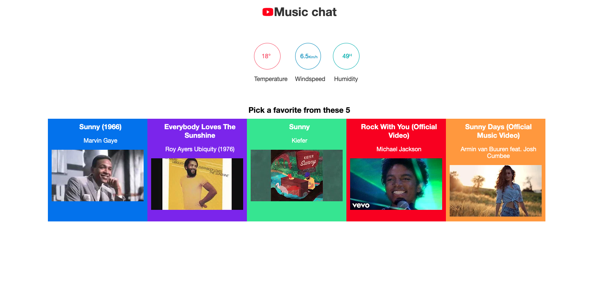
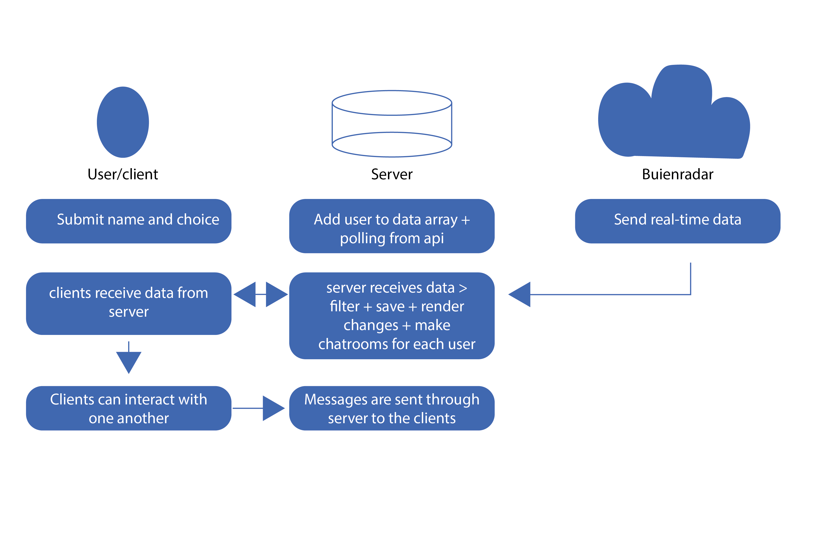

    

## The concept
The concept was a matching app that matches you with people who have the same music taste as you. To do this I used the Youtube API to pick a few songs. The song choice is made based on the weather, cold weather gives different songs than warm or hot weather. After picking a song the user is able to see other users and their choices, a user can then chat with other users.

## The API
The API I'm using is the Buienradar API, it gives free weather data for a few measuring stations in the Netherlands. The data is freely accessible and comes in Json format.
I had planned to use the YOutube API but had difficulty acquiring an access token so decided to scrape the data manually since I wouldn't be needing a lot either way.
I combined these two data points to make an interesting app.

### Data from API
  Temeprature
  Humidity
  Windspeed
  Feeling Temperature
  Song data includes
    Song title
    Artist
    Length
    Song Thumbnail/cover

### Limitations
  There are no experienced limits to the API and i could make as many requests without having any issues.

## Data life cycle

    
